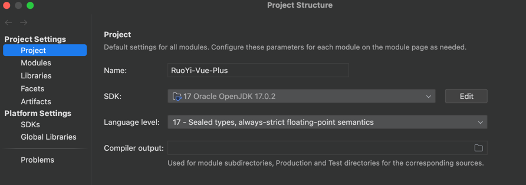
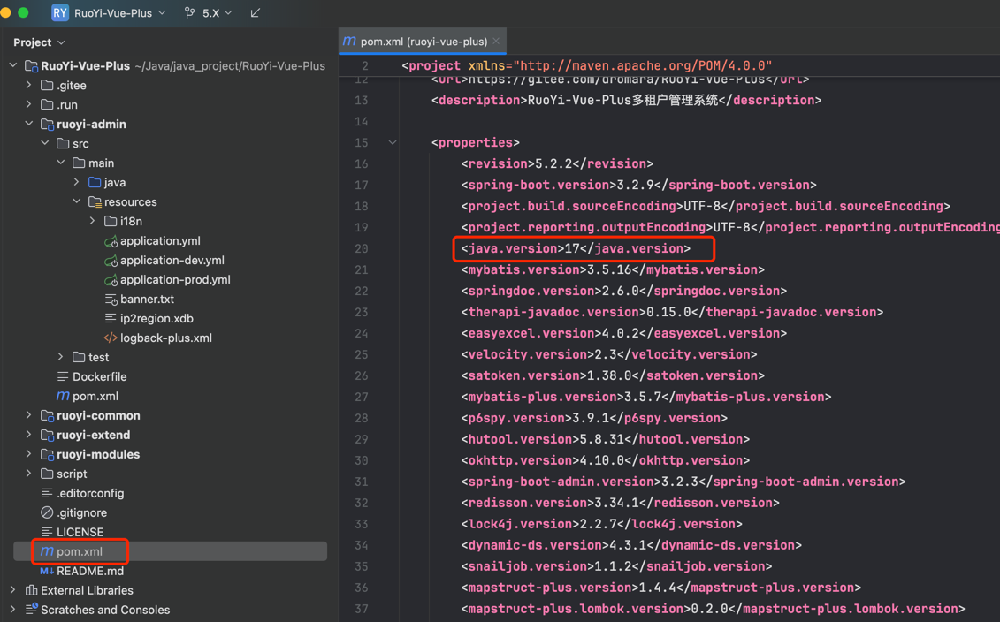
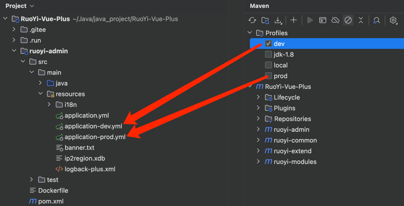

# 第1节：5.X项目初始化

作者：你的泪丶烫伤我的脸
<br/>QQ：12345678
<br/>WX：12345678

>沉淀、分享、成长，让自己和他人都能有所收获！😄

## 一、项目运行必备环境
- openjdk-17/21 (Spring官方推荐使用JDK https://bell-sw.com/pages/downloads/)
- mysql 5.7/8.0 (作者本人使用 mysql 8.X)
- oracle >= 12c (未使用)
- postgres 13/14 (未使用)
- sqlserver 2017/2019 (未使用)
- redis 5.X/6.X/7.X 由于框架大量使用了redis特性 版本必须 >= 5.X
- minio 本地文件存储 或 阿里云 腾讯云 七牛云等一切支持S3协议的云存储
- maven >= 3.8.X (作者本人使用 maven 3.9.X)
- nodejs >= 18.18
- npm >= 8.X (7.X确认有问题)
- idea 2022 2024 (一定不要使用2023后果自负 bug太多影响项目开发)

## 二、项目代码地址
- gitee（码云）：https://gitee.com/dromara/RuoYi-Vue-Plus.git
- GitHub：https://github.com/dromara/RuoYi-Vue-Plus.git

## 三、项目分支说明
- `5.X` 主分支 5.X版本 稳定发布分支
- `dev` 开发分支 代码随时更新 不推荐使用 经测试后会发布到主分支
- `future/*` 新功能预览分支

## 四、IDEA 拉取项目
- 打开IDEA 选择菜单  File -> New -> Project from Version Control -> 选择Git -> 输入项目地址 -> 点击Clone
- 等待项目拉取完成

## 五、项目目录结构
```java
RuoYi-Vue-Plus
├─ ruoyi-admin                         // 管理模块 [8080,28080]
│  └─ RuoYiApplication                 // 启动类
│  └─ RuoYiServletInitializer          // 容器部署初始化类
│  └─ resources                        // 资源文件
│      └─ i18n/messages.properties     // 国际化配置文件
│      └─ application.yml              // 框架总配置文件
│      └─ application-dev.yml          // 开发环境配置文件
│      └─ application-prod.yml         // 生产环境配置文件
│      └─ banner.txt                   // 框架启动图标
│      └─ logback-plus.xml             // 日志配置文件
│      └─ ip2region.xdb                // IP区域地址库
├─ ruoyi-extend                        // 扩展模块
│  └─ ruoyi-monitor-admin              // admin监控模块 [9090]
│  └─ ruoyi-snailjob-server            // 任务调度中心模块 [8800,17888]
├─ ruoyi-common                        // 通用模块
│  └─ ruoyi-common-bom                 // common依赖包管理
│  └─ ruoyi-common-core                // 核心模块
│  └─ ruoyi-common-doc                 // 系统接口模块
│  └─ ruoyi-common-encrypt             // 数据加解密模块
│  └─ ruoyi-common-excel               // excel模块
│  └─ ruoyi-common-idempotent          // 幂等功能模块
│  └─ ruoyi-common-job                 // 定时任务模块
│  └─ ruoyi-common-json                // 序列化模块
│  └─ ruoyi-common-log                 // 日志模块
│  └─ ruoyi-common-mail                // 邮件模块
│  └─ ruoyi-common-mybatis             // 数据库模块
│  └─ ruoyi-common-oss                 // oss服务模块
│  └─ ruoyi-common-ratelimiter         // 限流功能模块
│  └─ ruoyi-common-redis               // 缓存服务模块
│  └─ ruoyi-common-satoken             // satoken模块
│  └─ ruoyi-common-security            // 安全模块
│  └─ ruoyi-common-sensitive           // 脱敏模块
│  └─ ruoyi-common-sms                 // 短信模块
│  └─ ruoyi-common-social              // 社交三方模块
│  └─ ruoyi-common-sse                 // sse流推送模块
│  └─ ruoyi-common-tenant              // 租户模块
│  └─ ruoyi-common-translation         // 通用翻译模块
│  └─ ruoyi-common-web                 // web模块
│  └─ ruoyi-common-websocket           // websocket服务集成模块
├─ ruoyi-modules                       // 模块组
│  └─ ruoyi-demo                       // 演示模块
│  └─ ruoyi-generator                  // 代码生成模块
│  └─ ruoyi-job                        // 任务调度服务
│  └─ ruoyi-system                     // 业务模块
│  └─ ruoyi-workflow                   // 工作流模块
├─ plus-ui                             // 前端框架 [80]
├─ script                              // 系统脚本包
│  └─ bin                              // 运行脚本包
│  └─ docker                           // docker相关脚本
│  └─ sql                              // sql脚本
├─ .run                                // 执行脚本文件
├─ .editorconfig                       // 编辑器编码格式配置
├─ LICENSE                             // 开源协议
├─ pom.xml                             // 公共依赖
├─ README.md                           // 框架说明文件
```

## 六、选择项目运行JDK（17/21）
- 打开 IDEA 选择菜单 `File -> Project Structure -> Project Settings -> Project -> Project SDK`



- 切换JDK版本，需要修改`项目根目录`下`pom.xml`文件的默认JDK版本



## 七、选择 Maven 对应环境

-  `dev` 开发环境配置文件
-  `prod` 生产环境配置文件

## 八、刷新 Maven 依赖
- 每次修改 Maven 环境需要刷新依赖