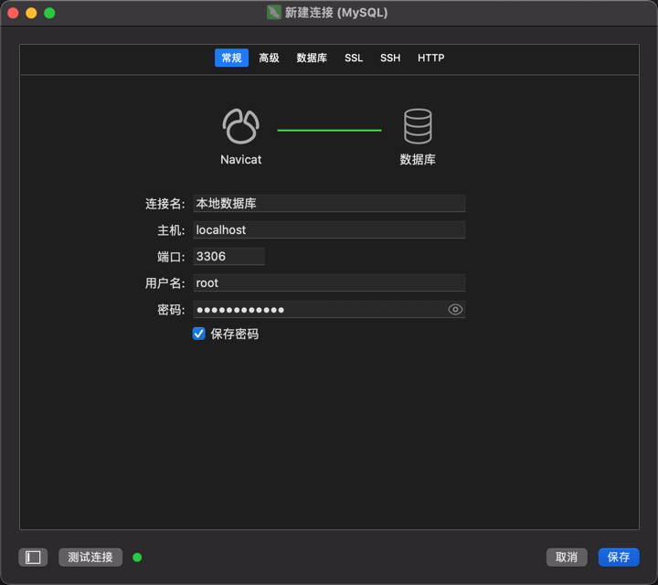
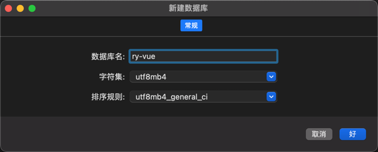
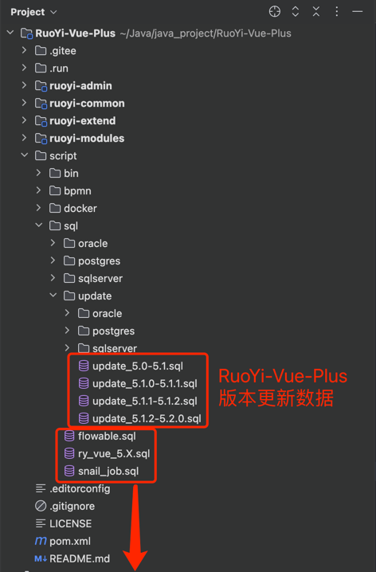
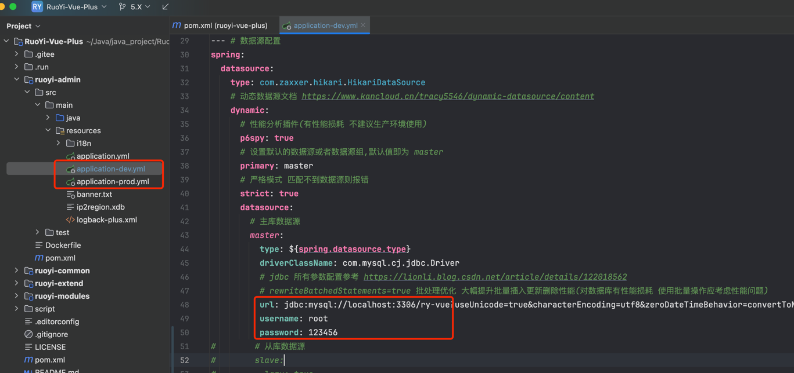
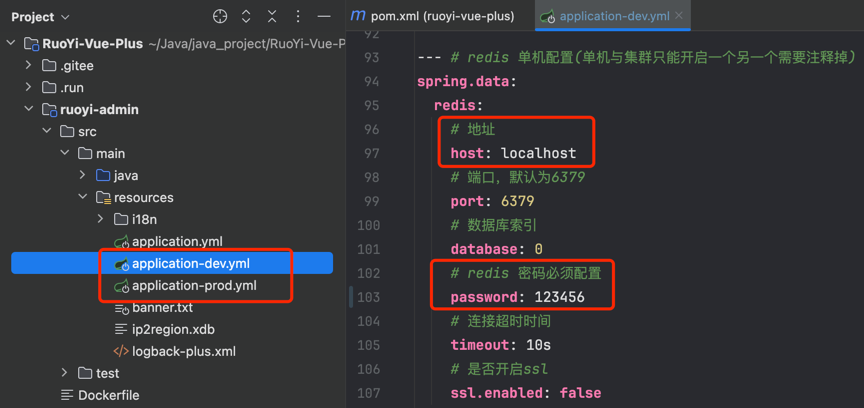

# 第2节：5.X数据库初始化

作者：你的泪丶烫伤我的脸
 QQ：12345678
 WX：12345678

>沉淀、分享、成长，让自己和他人都能有所收获！😄

## 一、准备工作
- 本文使用 Navicat Premium 16 进行数据库连接，其他工具大同小异
  - Mysql 下载、安装、启动 （自行百度，本文使用 mysql 8.0.33 版本）
  - Redis 下载、安装、启动 （自行百度，本文使用 Redis 6.2.12 版本）)
  - Navicat Premium 16 安装（其他版本或其他工具亦可）
  - [Tiny RDM](https://redis.tinycraft.cc) 下载、安装  (其他工具亦可)

      
## 二、数据库初始化
- 打开 `Navicat Premium 16`，选择 `连接` -> `连接类型` -> `MySQL`

- 输入数据库连接信息，点击 `测试连接` 按钮，如果连接成功，则会出现 `连接成功` 的提示信息

- 保存成功后，点击 `连接` -> `新建数据库`

- 输入数据库名称，点击 `确定` 按钮，即可创建数据库

## 三、导入表结构

- `flowable.sql`    工作流表结构 - 导入
- `ry_vue_5.X.sql`  系统表结构 - 首次使用直接导入即可，升级时只需导入上方对应版本的 update_xxx.sql
- `snail_job.sql`   定时任务表结构 - 导入

## 四、配置数据库连接

`注意：根据第七点勾选的maven对应环境修改对应的配置文件`
- 修改为自己的数据库连接信息

## 五、配置 Redis 连接

