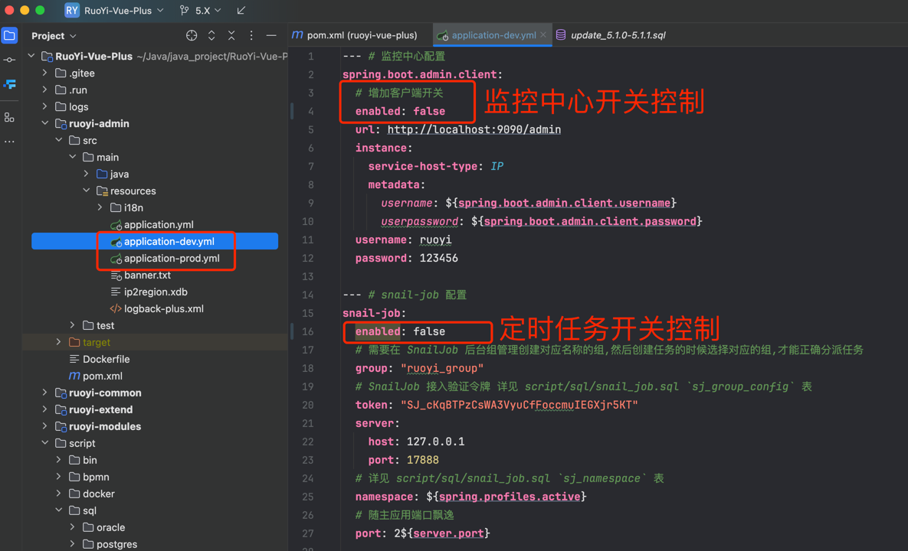

# 第3节：5.X项目启动

作者：你的泪丶烫伤我的脸
 QQ：12345678
 WX：12345678

>沉淀、分享、成长，让自己和他人都能有所收获！😄

## 一、准备工作
- 必须启动基础建设: `mysql` `redis`
- 可选启动基础建设: `minio`(文件上传) `monitor`(监控) `snailjob`(定时任务)

## 二、服务启动顺序

- `DromaraApplication` 主应用服务
- `MonitorAdminApplication` Admin监控服务 (非必要 可参考对应文档关闭 [搭建Admin监控](https://plus-doc.dromara.org/#/ruoyi-vue-plus/quickstart/admin_init))
- `SnailJobServerApplication` 任务调度中心服务 (非必要 可参考对应文档关闭 [搭建调度中心](https://plus-doc.dromara.org/#/ruoyi-vue-plus/quickstart/snail_job_init))

> 如果开启`监控服务`和`定时任务`，需优先启动 `MonitorAdminApplication` 与 `SnailJobServerApplication` 
> 
> 最后启动 主服务 `DromaraApplication`

## 三、启动项目
- 启动 `DromaraApplication` 主应用服务，出现下图所示信息即为启动成功

