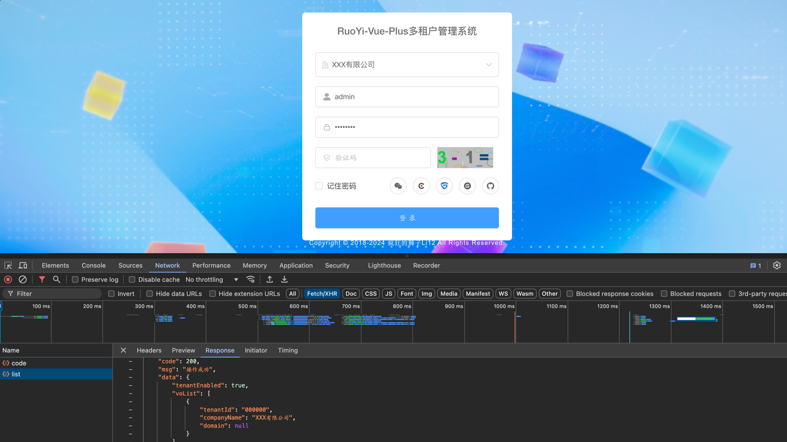
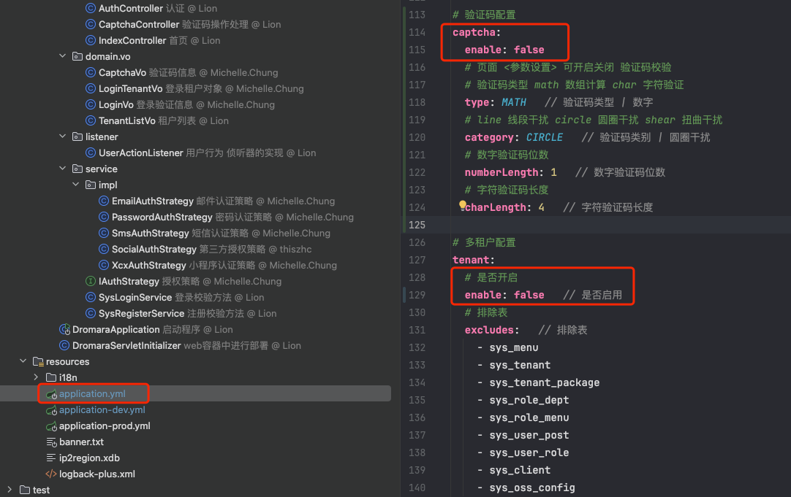
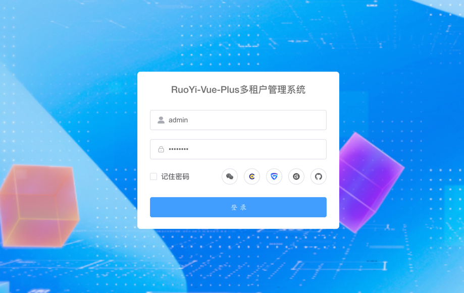

# 第2节：登录篇

作者：你的泪丶烫伤我的脸
 QQ：12345678
 WX：12345678

>沉淀、分享、成长，让自己和他人都能有所收获！😄

## 一、登录前准备工作

`以下为拉取项目后未改变前、后端端口号的情况，若前、后端端口号已改变，请自行修改`

- 首先启动前、后端项目，浏览器访问 http://localhost:80 进入登录页面

- 可以根据需要开启或者关闭多租户和验证码功能

- 修改后，重启服务，刷新页面，即可看到关闭多租户和验证码的登录页面

## 二、登录流程

- 输入用户名（`admin`）和密码(`admin123`)，点击登录按钮
- 打开开发者工具，看到前端发送请求URI为 `/auth/login`，请求方法为 `POST`
- 打开IDEA，按两下shift，搜索 `auth/login`，找到 `AuthController.java` 文件，找到 `login` 方法，打断点，查看请求参数

