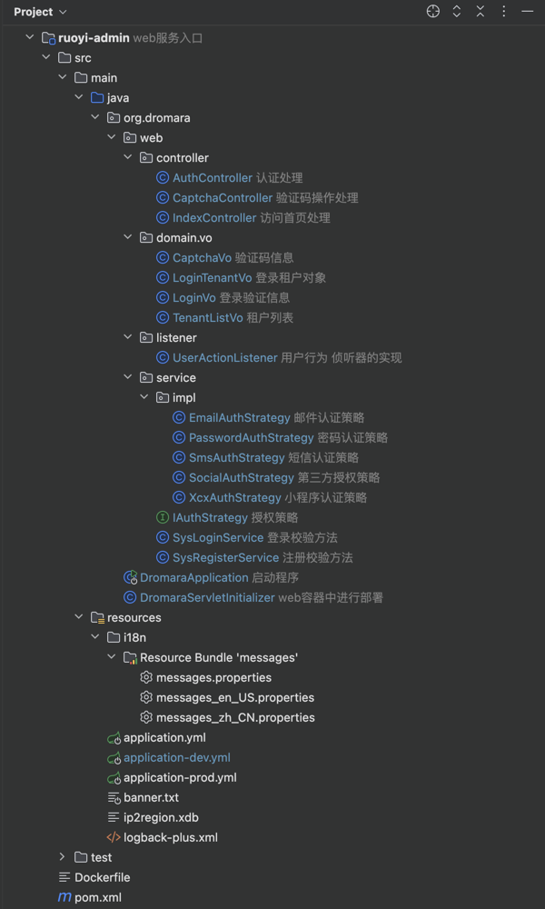

# 第1节：ruoyi-admin 模块结构分析

作者：你的泪丶烫伤我的脸
<br/>QQ：12345678
<br/>WX：12345678

>沉淀、分享、成长，让自己和他人都能有所收获！😄

## 一、web服务入口模块结构



## 二、结构示意图-说明
```java
RuoYi-Vue-Plus
├─ ruoyi-admin                         // 管理模块 [8080,28080]
│  └─ controller                       // 控制器层
│      └─ AuthController               // 认证处理 - 注册、登录、退出、第三方登录、授权、租户列表
│      └─ CaptchaController            // 验证码操作处理 - 短信验证码、图片验证码、邮箱验证码
│      └─ IndexController              // 首页处理 - 访问首页处理
│  └─ domain.vo                        // 返回给前端的VO对象
│      └─ CaptchaVo                    // 返回给前端的VO对象 - 验证码信息
│      └─ LoginTenantVo                // 返回给前端的VO对象 - 登录租户对象
│      └─ LoginVo                      // 返回给前端的VO对象 - 登录验证信息
│      └─ TenantListVo                 // 返回给前端的VO对象 - 租户列表对象
│  └─ listener                         // 侦听器
│      └─ UserActionListener           // 实现 SaTokenListener 接口，监听用户登录、注销等事件
│  └─ service                          // 侦听器
│      └─ impl
│          └─ EmailAuthStrategy        // 邮件认证策略 - 实现IAuthStrategy接口，登录->校验邮箱验证码
│          └─ PasswordAuthStrategy     // 密码认证策略 - 实现IAuthStrategy接口，登录->校验图片验证码
│          └─ SmsAuthStrategy          // 短信认证策略 - 实现IAuthStrategy接口，登录->校验短信验证码
│          └─ SocialAuthStrategy       // 第三方授权策略 - 实现IAuthStrategy接口，登录->第三方授权
│          └─ XcxAuthStrategy          // 小程序认证策略 - 调用 wx.login 授权后获取用户信息
│      └─ IAuthStrategy                // 认证策略接口
│      └─ SysLoginService              // 登录校验方法 - 登录校验、登录租户校验、第三方登录校验
│      └─ SysRegisterService           // 注册校验方法 - 注册校验、验证码校验
│  └─ RuoYiApplication                 // 启动类
│  └─ RuoYiServletInitializer          // 容器部署初始化类
│  └─ resources                        // 资源文件
│      └─ i18n/messages.properties     // 国际化配置文件 - 可根据自己需要进行配置
│      └─ application.yml              // 框架总配置文件 - 全局通用的配置可以写到这里
│      └─ application-dev.yml          // 开发环境配置文件
│      └─ application-prod.yml         // 生产环境配置文件
│      └─ banner.txt                   // 框架启动图标 - 可以替换掉默认的启动图标
│      └─ logback-plus.xml             // 日志配置文件 - 可根据自己需要进行配置
│      └─ ip2region.xdb                // IP区域地址库
│  └─ pom.xml                          // 依赖管理文件 - 管理项目依赖（后期新加的模块需要在这里引入）
```